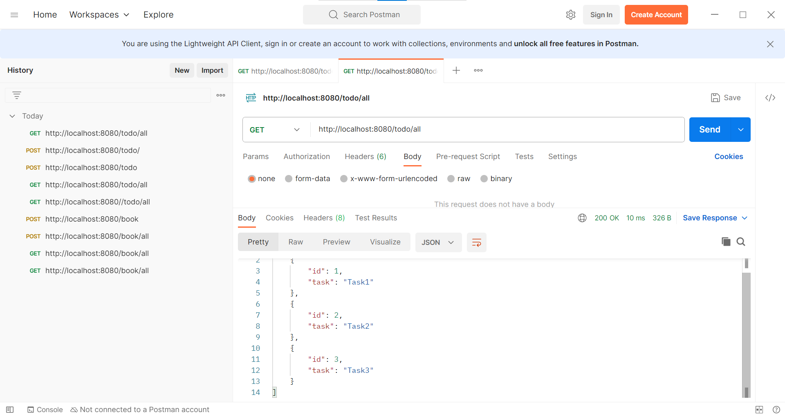
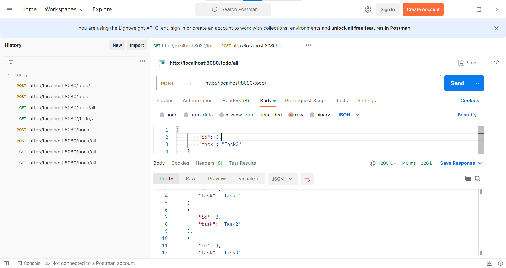
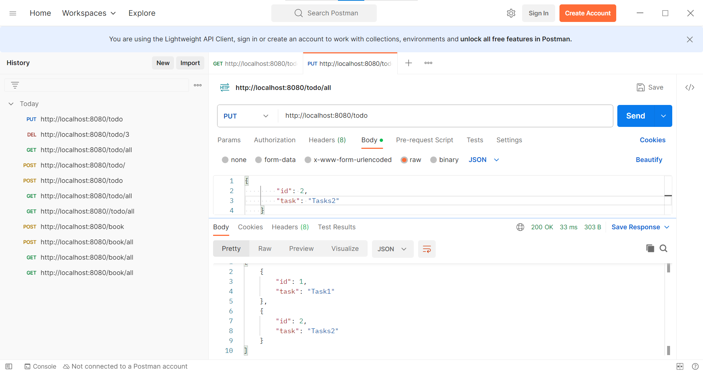
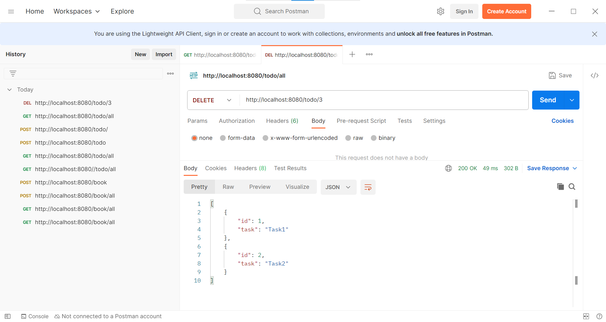

[4:42 PM] Ranjith Senthilkumar

# API Creation Using Springboot and MYSQL.

This project is developed using JAVA V-17.0.8 and Springboot.
 
Text editor used: INTELLIJ.
 
Project: Maven based project.

## 🛠 Skills

------------      

    - Springboot

    - Java

    - JDBC Template

    - MYSQL

## OverView of the project:

---------------------------

    Here,We create the backend process to store the data's in Database, it can be accessed through (@RestController) : @RequestMapping, Mapping Methods(GET,PUT,POST,DELETE)

## Project Structure

⏩Models:

   - Todo

⏩Controller

   - TodoController

⏩Repository

   - TodpRepository
 
## Dependencies Used

1. spring-boot-starter-web

2. mysql-connector-java

3. spring-boot-starter-jdbc

---------------------------------

## Screenshoots

Get method :

Post Method:

Put method:

Delete Method:

